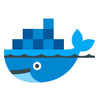
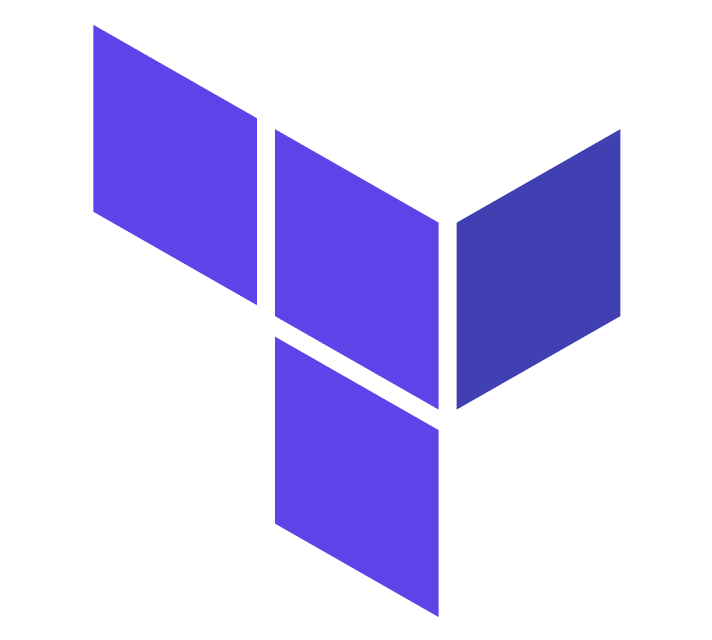

# Hi :wave: I'm Benghalem Aziz

Hi there! My name is **Benghalem Aziz**, and I am a **Computer Engineer** with a passion for **Front-End** Development and **DevOps**. I have a keen interest in exploring new technologies and staying updated with the latest trends in the industry. With a solid technical foundation and a drive for continuous learning, I strive to deliver high-quality solutions that meet both user and business needs.

# :black_joker: About Me:

* :computer: I'm a **Computer Engineering**

* :mag_right: I'm looking to collaborate on full **DevOps** project

*  :man_technologist: Well-organised person, problem solver, independent employee with high attention to detail.

* :point_right: Interested in the entire frontend spectrum and working on ambitious projects with positive people.

* :dart: 2023 Goal: DevSecOps and explore new DevOps tools & Back-End	(Node.js)

> **Note:**  📖 I’m currently learning everything 🤣.
--- 
# :fireworks: Skills & Experience

Here are a few technologies I’ve been working with recently:

* Proficient in HTML, CSS, JavaScript, and React
* Knowledgeable in DevOps tools such as Docker & Kubernetes and Cloud (AWS)
* Familiar with Agile development methodologies
* Strong problem-solving and analytical skills
* Excellent communication and teamwork abilities

---
# Languages and Tools:

--- 

# :diamond_shape_with_a_dot_inside: My Projects:

Let's Discover Together Some Live Projects

* Project 1 Go to the <a href="https://github.com/Benghalem/Portfolio-Template.git" style="font-style: italic"> Portfolio Template </a>
* Project 2  Go to the <a href="https://github.com/Benghalem/GPT-3-Open-AI-.git" style="font-style: italic"> GPT-3 OpenAI </a>
* Project 3 Go to the <a href="https://github.com/Benghalem/Booking-App.git" style="font-style: italic"> Booking App </a>
* Project 4 Go to the <a href="https://github.com/Benghalem/Templet-03.git" style="font-style: italic"> ModernArt </a>
* Project 5 Go to the <a href="https://github.com/Benghalem/Heaven-Cars.git" style="font-style: italic"> Heaven Cars </a>

