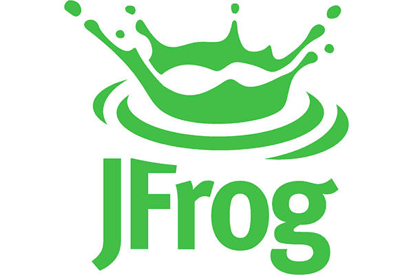

# Hi :wave: I'm Benghalem Aziz

Hi there! My name is **Benghalem Aziz**, and I am a **Computer Engineer** with a passion for **Front-End** Development and **DevOps**. I am always excited to learn about new technologies and strive to keep myself updated with the latest trends in the industry.

# :black_joker: About Me:

* :computer: I'm a **Computer Engineering**

* :mag_right: I'm looking to collaborate on full **DevOps** project

*  :man_technologist: Well-organised person, problem solver, independent employee with high attention to detail.

* :point_right: Interested in the entire frontend spectrum and working on ambitious projects with positive people.


* :dart: 2023 Goal: DevSecOps and explore new DevOps tools & Back-End	(Node.js)

> **Note:**  📖 I’m currently learning everything 🤣.
--- 
# :fireworks: Skills & Experience

Here are a few technologies I’ve been working with recently:

* Proficient in HTML, CSS, JavaScript, and React
* Knowledgeable in DevOps tools such as Docker and Kubernetes
* Familiar with Agile development methodologies
* Strong problem-solving and analytical skills
* Excellent communication and teamwork abilities


+--------------------+------------------+-------------+
|Front-End           |Back-End          |DevOpes      |
+====================+==================+=============+
| 1. React           |1. PostgreSQL     |1. Docker
| 2. JavaScript(ES6+)|2. MySQL          |2. Ansible
| 3. FrontBasics     |3. SQL            |3. Kubernetes
| 3. Graph QL        |4. Node.js (Soon) |4. Terraform
| 4. Gatsby          |                  |5. Git & Github
| 3. Tailwind (Soon!)|                  | 
|                    |                  |
+--------------------+------------------+-------------+
| Second row spanning
| on two columns
---
# Languages and Tools:

<p align="left">





<p>

--- 

# :diamond_shape_with_a_dot_inside: My Projects:

Let's Discover Together Some Live Projects

* Project 1 Go to the 
<a href="https://github.com/Benghalem/Portfolio-Template.git" style="font-style: italic">
    Portfolio Template
</a>
* Project 2  Go to the 
<a href="https://github.com/Benghalem/GPT-3-Open-AI-.git" style="font-style: italic">
    GPT-3 OpenAI
</a>
* Project 3 Go to the 
<a href="https://github.com/Benghalem/Booking-App.git" style="font-style: italic">
    Booking App
</a>
* Project 4 Go to the 
<a href="https://github.com/Benghalem/Templet-03.git" style="font-style: italic">
    ModernArt
</a>
* Project 5 Go to the 
<a href="https://github.com/Benghalem/Heaven-Cars.git" style="font-style: italic">
    Heaven Cars
</a>

```markdown
> **Note:** Block quotes can be used to highlight important ideas.
```
This renders to:
> **Note:** Block quotes can be used to highlight important ideas.


Summary:
As a highly skilled Computer Engineer with expertise in Front-End Development and DevOps, I am dedicated to delivering high-quality solutions to clients and organizations. With experience in a variety of programming languages and technologies, I am able to adapt to new challenges and stay ahead of the latest trends in the industry.

Skills:

    Proficient in HTML, CSS, JavaScript, and React
    Experience with Python, Java, and C++
    Knowledgeable in DevOps tools such as Docker and Kubernetes
    Familiar with Agile development methodologies
    Strong problem-solving and analytical skills
    Excellent communication and teamwork abilities

Experience:

Front-End Developer, XYZ Company (2019 - Present)

    Developed and maintained client-facing websites using HTML, CSS, and JavaScript
    Collaborated with design and back-end teams to ensure seamless user experience
    Implemented responsive design to optimize site performance on mobile devices
    Conducted A/B testing to improve site metrics and user engagement

DevOps Engineer, ABC Company (2017 - 2019)

    Managed deployment and scaling of containerized applications using Docker and Kubernetes
    Created automation scripts to streamline development and deployment processes
    Monitored and optimized system performance using tools such as Grafana and Prometheus
    Collaborated with development and operations teams to ensure continuous integration and delivery

Education:

Bachelor of Science in Computer Engineering, University of Science and Technology (2013 - 2017)

    Coursework in programming languages, data structures and algorithms, and computer networks

Certifications:

    AWS Certified DevOps Engineer – Professional
    Certified Kubernetes Administrator (CKA)


